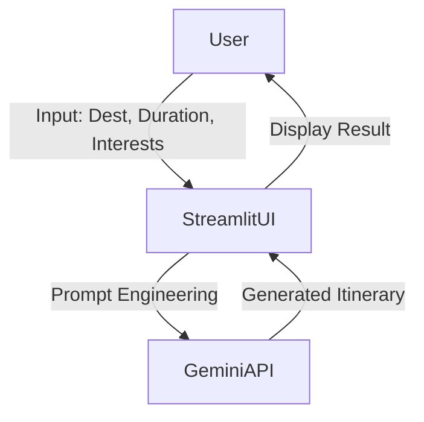

# Architecture & Design Document

## 1. Overview
**Explore with AI** is a lightweight web application designed to generate personalized travel itineraries using generative AI. It leverages Streamlit for the user interface and Google's Gemini Flash model for content generation.

## 2. Architecture Diagram

## 3. Tech Stack

-   **Frontend**: Streamlit (Python-based web framework)
-   **Backend**: Python 3.8+
-   **AI Model**: Google Gemini 2.5 Flash
-   **Deployment**: Local execution or Streamlit Cloud

## 4. Components

### 4.1. `travel.py` (Main Application)
The core logic resides in a single Python file:
-   **Page Config**: Sets up the app title, icon, and layout.
-   **API Handling**: Initializes the Google Gemini client securely using API keys from `.streamlit/secrets.toml` or environment variables.
-   **Custom CSS**: Injects CSS to style the app with a modern, gradient-based theme.
-   **Input Form**: Collects user input (Destination, Duration, Interests).
-   **Prompt Engineering**: Constructs a structured prompt for the AI model to ensure consistent itinerary format.
-   **Generation Logic**: Calls the Gemini API and handles potential errors.
-   **Display**: Formats and presents the generated itinerary in a readable card layout.

### 4.2. Configuration
-   **.streamlit/secrets.toml**: Stores sensitive API keys (not committed to version control).
-   **requirements.txt**: Lists project dependencies.

## 5. Data Flow

1.  **User Input**: The user enters travel details via the Streamlit interface.
2.  **Processing**: The app constructs a prompt string incorporating the user's inputs.
3.  **API Call**: The prompt is sent to the Google Gemini API (`gemini-2.5-flash`).
4.  **Response**: The AI model returns a structured text response containing the itinerary.
5.  **Rendering**: The app processes the response (basic formatting) and displays it to the user.

## 6. Future Enhancements

-   **Map Integration**: Display recommended locations on an interactive map.
-   **Downloadable Itineraries**: Allow users to download their plan as a PDF or text file.
-   **User Accounts**: Save and retrieve past itineraries.
-   **Budget Estimation**: Provide estimated costs for activities and dining.
