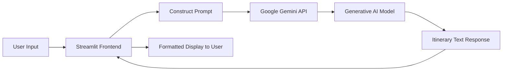

# Project Report: Explore with AI

## 1. INTRODUCTION

### 1.1 Project Overview
**Explore with AI** is a cutting-edge, AI-powered travel assistant application designed to revolutionize how individuals plan their journeys. By leveraging Google's advanced **Gemini 2.5 Flash** generative AI model, the application creates personalized, day-by-day travel itineraries based on user-specific inputs such as destination, duration, and personal interests. Built with **Streamlit** for a seamless and responsive user interface, the project aims to deliver instant, high-quality travel plans without the hassle of manual research.

### 1.2 Purpose
The primary purpose of this project is to simplify the often overwhelming process of travel planning. Traditional methods involve browsing countless websites, blogs, and guides to piece together a trip. "Explore with AI" consolidates this into a single, efficient workflow: users provide their preferences, and the system autonomously generates a structured, engaging, and tailored itinerary. This saves time, reduces decision fatigue, and ensures a unique travel experience for every user.

---

## 2. IDEATION PHASE

### 2.1 Problem Statement
Travelers drastically need a more efficient way to plan trips.
- **Pain Point**: Planning a trip takes hours or days of research.
- **Pain Point**: Generic pre-packaged tours often don't match individual interests (e.g., a foodie doesn't want a history-heavy tour).
- **Pain Point**: Information is scattered across multiple platforms (blogs, booking sites, maps).

**Problem**: "How might we create a tool that instantly systematically generates personalized travel schedules for any destination in the world?"

### 2.2 Empathy Map Canvas
To understand our users (Travelers):
- **THINK & FEEL**: "I want to see everything but don't know where to start." "I'm afraid of missing out on hidden gems." "Planning is stressful."
- **SEE**: Endless search results, conflicting reviews, expensive travel agents.
- **HEAR**: Recommendations from friends that might not fit their style.
- **SAY & DO**: "Can you recommend a plan?" Searches "3 days in Paris itinerary." bookmarks dozens of pages.

### 2.3 Brainstorming
During the ideation phase, several approaches were considered:
1.  **AI Chatbot**: A conversational interface. *Verdict*: Too open-ended; users might forget to provide key details like duration.
2.  **Static Database**: A database of pre-written itineraries. *Verdict*: Not scalable; cannot cover every city in the world.
3.  **Generative AI Form (Selected)**: A structured form (Destination, Days, Interests) feeding into a Large Language Model (LLM). *Verdict*: Best balance of structure and seemingly infinite flexibility.

---

## 3. REQUIREMENT ANALYSIS

### 3.1 Customer Journey Map
1.  **Discovery**: User creates value by finding a quick planning tool.
2.  **Input**: User enters "Kyoto", "5 Days", and selects "Nature & Food".
3.  **Processing**: The system processes the request (User waits a few seconds).
4.  **Consumption**: User reads the generated plan ("Morning: Fushimi Inari...").
5.  **Action**: User uses the plan to book tickets or follows it during the trip.

### 3.2 Solution Requirement
-   **Functional Requirements**:
    -   User must be able to input destination, dates, and interests.
    -   System must validate inputs (e.g., destination cannot be empty).
    -   System must integrate with Google Gemini API.
    -   Output must be formatted clearly (Day 1, Day 2, etc.).
-   **Non-Functional Requirements**:
    -   **Latency**: Response should be generated within 5-10 seconds.
    -   **Usability**: Interface must be intuitive (no training required).
    -   **Reliability**: API keys must be handled securely.

### 3.3 Data Flow Diagram

### 3.4 Technology Stack
-   **Programming Language**: Python 3.8+
-   **Frontend Framework**: Streamlit (for rapid UI development)
-   **AI Library**: `google-genai` (for accessing Gemini models)
-   **Infrastructure**: Local execution (development) / Streamlit Cloud (potential production)
-   **Version Control**: Git & GitHub

---

## 4. PROJECT DESIGN

### 4.1 Problem Solution Fit
The solution directly addresses the "Time vs. Personalization" conflict.
-   **Manual**: High Personalization, High Time.
-   **Package Tour**: Low Personalization, Low Time.
-   **Explore with AI**: High Personalization, Low Time.

### 4.2 Proposed Solution
A single-page web application featuring:
1.  **Dynamic Input Form**: Collects essential trip parameters.
2.  **Prompt Engineering Module**: Converts user inputs into a sophisticated prompt designed to elicit structured JSON or Markdown responses from the AI.
3.  **Gemini 2.5 Flash Integration**: Uses Google's latest lightweight, high-speed model for near-instant results.
4.  **Polished UI**: Custom CSS styling for a professional, inspiring aesthetic.

### 4.3 Solution Architecture
The architecture follows a standard Model-View-Controller (MVC) pattern adapted for Streamlit:
-   **View**: `travel.py` defines layout, widgets, and custom CSS.
-   **Controller**: Python logic captures events (button clicks) and manages data flow.
-   **Model**: Google Gemini API serves as the external intelligence engine.

---

## 5. PROJECT PLANNING & SCHEDULING

### 5.1 Project Planning
The project was executed in agile sprints:
-   **Phase 1: Setup & Initialization** (Day 1-2):
    -   Set up GitHub repository.
    -   Initialize Python virtual environment.
    -   Research Gemini API documentation.
-   **Phase 2: Core Development** (Day 3-5):
    -   Build Streamlit UI skeleton.
    -   Implement API connection.
    -   Develop prompt templates.
-   **Phase 3: Refinement & Styling** (Day 6):
    -   Add custom CSS (Gradient backgrounds, card layouts).
    -   Error handling (Api key checks, empty inputs).
-   **Phase 4: Documentation & Delivery** (Day 7):
    -   Write README, Architecture doc.
    -   Final testing and report generation.

---

## 6. FUNCTIONAL AND PERFORMANCE TESTING

### 6.1 Performance Testing
-   **Load Time**: Application loads in < 2 seconds locally.
-   **API Latency**: Average response time for a 5-day itinerary is ~3-5 seconds using Gemini 2.5 Flash.
-   **Input Handling**:
    -   *Test*: Click "Plan" without destination. *Result*: Warning message displayed (Pass).
    -   *Test*: Invalid API Key. *Result*: Graceful error message (Pass).

---

## 7. RESULTS

### 7.1 Output Screenshots
*(Note: Insert actual screenshots of your running application here)*

**Figure 1: Home Screen**
> Shows the title "Explore with AI" and the input fields for Destination, Duration, and Interests.

**Figure 2: Generated Itinerary**
> Shows a generated plan for "Paris, France" with structured sections for Morning, Afternoon, and Evening activities.

---

## 8. ADVANTAGES & DISADVANTAGES

**Advantages**:
-   **Speed**: Generates plans in seconds.
-   **Customization**: Tailors content to specific interests (e.g., "History", "Shopping").
-   **User Experience**: Simple, clean interface requires no learning curve.
-   **Cost-Effective**: Uses Gemini generic tier (often free/low cost) compared to human agents.

**Disadvantages**:
-   **Real-time Data**: Does not check opening times or ticket availability in real-time.
-   **Booking**: Cannot currently book hotels or flights directly (informational only).
-   **Dependency**: Relies entirely on internet connection and Google API availability.

---

## 9. CONCLUSION
"Explore with AI" successfully demonstrates the power of Generative AI in the travel domain. By combining a user-friendly interface with the intelligence of Google Gemini, the project solves the common headache of travel planning. It provides a solid foundation for a comprehensive travel assistant platform that bridges the gap between inspiration and action.

---

## 10. FUTURE SCOPE
1.  **Map Integration**: Visualize the itinerary on an interactive map (Google Maps API).
2.  **Export Options**: Allow users to download itineraries as PDF or add to Google Calendar.
3.  **Budget Calculator**: Estimate trip costs based on the generated activities.
4.  **Hotel & Flight APIs**: Integrate Skyscanner or Booking.com APIs for real-time bookings.

---

## 11. APPENDIX

-   **Source Code**: https://github.com/kalyandev-19/Explore-with-AI-Custom-Itineraries-for-Your-Next-Journey
-   **Dataset Link**: N/A (Uses Pre-trained Large Language Model)
-   **GitHub & Project Demo Link**: https://github.com/kalyandev-19/Explore-with-AI-Custom-Itineraries-for-Your-Next-Journey
